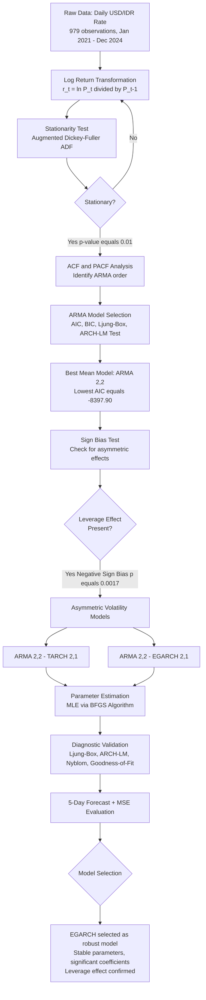

# USD/IDR Exchange Rate Forecasting
### Using ARMA-TARCH and ARMA-EGARCH Models

> **Undergraduate Thesis** | Department of Mathematics, Universitas Diponegoro | 2025
> **Author:** Luluk Ainul Latifah

---

## 📌 Overview

This project models and forecasts the volatility of the Indonesian Rupiah (IDR)
against the US Dollar (USD) using asymmetric GARCH-family models.
The exchange rate exhibits **volatility clustering** and **leverage effects** 
where negative shocks (depreciation) produce stronger volatility responses
than positive shocks of the same magnitude.

| Item | Detail |
|------|--------|
| **Data** | Daily USD/IDR Transaction Rate — Bank Indonesia |
| **Period** | January 4, 2021 – December 31, 2024 |
| **Observations** | 979 data points |
| **Language** | R |
| **Key Packages** | rugarch, tseries, ggplot2, FinTS, e1071, lmtest |

---

## ❓ Problem Statement

Standard time-series models assume **constant variance**, which fails to
capture the dynamic risk behavior of exchange rates. Specifically:

1. The USD/IDR series is **non-stationary** in raw form
2. Log returns exhibit **volatility clustering** (ARCH effects confirmed)
3. The **Sign Bias Test** confirms asymmetric effects — negative shocks
   have a disproportionately larger impact on volatility

---

## 🔬 Methodology


---

## 📊 Key Results

### ARMA Model Selection

| Model | AIC | BIC | Ljung-Box p-value | ARCH Test p-value |
|-------|-----|-----|-------------------|-------------------|
| AR(1) | -8385.49 | -8370.83 | 0.7155 | 7.24e-06 |
| MA(1) | -8388.50 | -8373.84 | 0.7014 | 6.25e-06 |
| ARMA(1,1) | -8391.32 | -8371.77 | 0.7863 | 1.46e-05 |
| ARMA(1,2) | -8391.45 | -8367.02 | 0.9943 | 9.12e-06 |
| ARMA(2,1) | -8392.31 | -8367.88 | 0.9887 | 6.73e-06 |
| **ARMA(2,2)** | **-8397.90** | -8368.59 | 0.8124 | 9.04e-07 |

✅ **ARMA(2,2) selected** — lowest AIC, all parameters significant

---

### Volatility Model Comparison

| Model | MSE | Parameter Stability (Nyblom) | Asymmetry Captured |
|-------|-----|------------------------------|--------------------|
| ARMA(2,2)-TARCH(2,1) | **2.343820e-05** | ❌ Unstable (stat=315.89 > critical=2.96) | ❌ Parameters not significant |
| ARMA(2,2)-EGARCH(2,1) | 2.366173e-05 | ✅ Stable (stat=2.55 < critical=2.96) | ✅ α₁ₐ and α₂ᵦ significant |

> **Conclusion:** EGARCH(2,1) is selected as the **more robust model** —
> despite a marginally higher MSE, it demonstrates stable parameters,
> statistically significant coefficients, and successfully captures
> the leverage effect.

---

### 5-Day Forecast (Jan 2–8, 2025)

| Date | Actual Rate | TARCH Forecast | EGARCH Forecast |
|------|-------------|----------------|-----------------|
| Jan 2, 2025 | Rp 16,157 | Rp 16,140.55 | Rp 16,140.28 |
| Jan 3, 2025 | Rp 16,236 | Rp 16,175.33 | Rp 16,176.00 |
| Jan 6, 2025 | Rp 16,217 | Rp 16,249.81 | Rp 16,250.65 |
| Jan 7, 2025 | Rp 16,193 | Rp 16,206.99 | Rp 16,204.96 |
| Jan 8, 2025 | Rp 16,169 | Rp 16,197.22 | Rp 16,196.27 |

> ✅ All actual values fall within the 95% confidence interval of both models.

---

## 📁 Repository Structure

```
usd-idr-exchange-rate-forecasting/
|
|-- README.md                 (you are here — project overview)
|
|-- code/
|   |-- analysis.R            (full R analysis script)
|
|-- data/
|   |-- README.md             (data source and description)
|
|-- output/
    |-- README.md             (output description)
```
---

## ⚙️ How to Reproduce

**Requirements:** R (≥ 4.0) and RStudio

**Step 1 — Install required packages:**
```r
install.packages(c("nloptr", "tseries", "e1071", "FinTS",
                   "rugarch", "ggplot2", "lmtest", "xts"))
```

**Step 2 — Prepare your data:**

The script expects a dataframe named `data2` with two columns:
- `Tanggal` — Date column (Date format)
- `Kurs` — USD/IDR exchange rate (numeric)

Data source: [Bank Indonesia — Kurs Transaksi BI](https://www.bi.go.id/id/statistik/informasi-kurs/transaksi-bi/Default.aspx)

**Step 3 — Run the script:**
```r
source("code/analysis.R")
```

---

## 🧠 Key Insights for Practitioners

1. **For policymakers:** The confirmed leverage effect means currency
   depreciation episodes require more aggressive policy responses
   than equivalent appreciation episodes.

2. **For risk managers:** EGARCH-based VaR estimates will be more
   conservative during market stress — appropriate for portfolio hedging.

3. **For forecasters:** The near-unit-root persistence (β₁ = 0.970)
   in EGARCH suggests volatility shocks are long-lasting in the
   USD/IDR market.

---

## 📚 References

- Engle, R.F. (1982). Autoregressive Conditional Heteroscedasticity. *Econometrica*, 50(4), 987–1007.
- Bollerslev, T. (1986). Generalized Autoregressive Conditional Heteroskedasticity. *Journal of Econometrics*, 31, 307–327.
- Nelson, D.B. (1991). Conditional Heteroskedasticity in Asset Returns. *Econometrica*, 59(2), 347–370.
- Glosten, L.R., Jagannathan, R., & Runkle, D.E. (1993). On the Relation between Expected Value and Volatility. *Journal of Finance*.

---

## 👤 Author

**Luluk Ainul Latifah**
Bachelor of Mathematics — Universitas Diponegoro (2025)
📧 luluklatifah363@gmail.com
🔗 [GitHub Profile](https://github.com/lulukainullatifah)
🔗 [LinkedIn](https://linkedin.com/in/lulukainullatifah)
